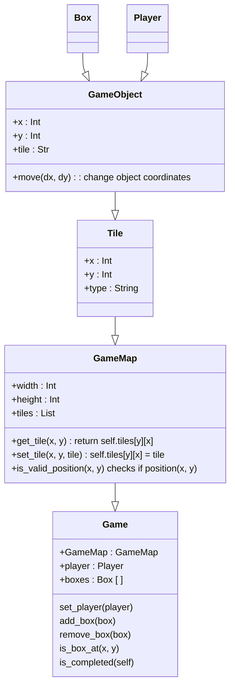

# MONITORING-SEA

## Made with https://mermaid.live/  

```mermaid
classDiagram
    Box --|> GameObject
    Player --|> GameObject
    GameObject --|> Tile
    Tile --|> GameMap
    GameMap --|> Game
    class Tile{
        +x : Int
        +y : Int
        +type : String
    }
        

    class GameObject{
        +x : Int
        +y : Int
        +tile : Str
        
        +move(dx, dy): change object coordinates
    }
    class Box

    class Player
    
    class GameMap{
        +width : Int
        +height : Int
        +tiles : List

        +get_tile(x, y) return self.tiles[y][x]
        +set_tile(x, y, tile) self.tiles[y][x] = tile
        +is_valid_position(x, y)  checks if position (x, y)
    }

    class Game{
        +GameMap : GameMap
        +player : Player 
        +boxes : Box [ ]

        set_player(player)
        add_box(box)
        remove_box(box)
        is_box_at(x, y)
        is_completed(self)
    }
```
